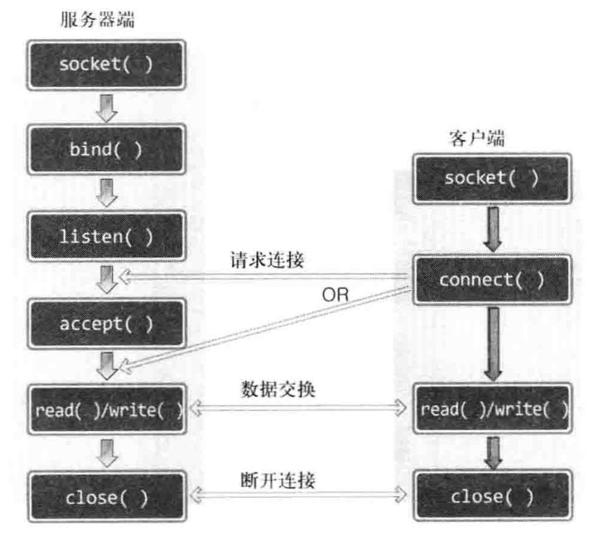

# C++回声服务器_1-简单版本

C++网络编程离不开socket编程。我们现在使用socket编写简单的回声服务器。

## 流程

这里所说的流程包括两部分：

1. socket函数调用流程。
2. 服务器与客户端交互流程。

### socket函数调用流程



### 服务器与客户端交互流程

回声服务器主要功能：服务器将接收到来自客户端的数据传回客户端。

服务器的功能：

- 服务器在同一时刻只能与一个客户端相连，并提供回声服务。
- 服务器依次向5个客户端提供回声服务并退出。

客户端的功能：

- 客户端接收终端的数据并发送到服务器。
- 客户端接收到Q或者q时，客户端断开连接并退出。

## 服务器代码

```c++
#include <cstdio>
#include <cstdlib>
#include <cstring>
#include <unistd.h>
#include <arpa/inet.h>
#include <sys/socket.h>

const int BUF_SIZE = 1024;

void error_handling(const char *message);

// 接收两个参数，argv[1]为端口号
int main(int argc, char *argv[]) {
    int server_socket;
    int client_sock;

    char message[BUF_SIZE];
    ssize_t str_len;
    int i;
    struct sockaddr_in server_addr;
    struct sockaddr_in client_addr;
    socklen_t client_addr_size;

    if (argc != 2) {
        printf("Usage: %s <port>\n", argv[0]);
        exit(1);
    }

    server_socket = socket(PF_INET, SOCK_STREAM, 0); // 创建IPv4 TCP socket
    if (server_socket == -1) {
        error_handling("socket() error");
    }

    // 地址信息初始化
    memset(&server_addr, 0, sizeof(server_addr));
    server_addr.sin_family = AF_INET; // IPV4 地址族
    server_addr.sin_addr.s_addr = htonl(INADDR_ANY); // 使用INADDR_ANY分配服务器的IP地址
    server_addr.sin_port = htons(atoi(argv[1])); // 端口号由第一个参数设置

    // 分配地址信息
    if (bind(server_socket, (struct sockaddr*)&server_addr, sizeof(sockaddr)) == -1) {
        error_handling("bind() error");
    }

    // 监听连接请求，最大同时连接数为5
    if (listen(server_socket, 5) == -1) {
        error_handling("listen() error");
    }

    client_addr_size = sizeof(client_addr);
    for (i = 0; i < 5; ++i) {
        // 受理客户端连接请求
        client_sock = accept(server_socket, (struct sockaddr*)&client_addr, &client_addr_size);
        if (client_sock == -1) {
            error_handling("accept() error");
        } else {
            printf("Connect client %d\n", i + 1);
        }

        // 读取来自客户端的数据
        while ((str_len = read(client_sock, message, BUF_SIZE)) != 0) {
            // 向客户端传输数据
            write(client_sock, message, (size_t)str_len);
            message[str_len] = '\0';
            printf("client %d: message %s", i + 1, message);
        }
    }
    // 关闭连接
    close(client_sock);

    printf("echo server\n");
    return 0;
}
```

## 客户端代码

```c++
#include <cstdio>
#include <cstdlib>
#include <cstring>
#include <unistd.h>
#include <arpa/inet.h>
#include <sys/socket.h>

const int BUF_SIZE = 1024;

void error_handling(const char *message);

// 接收两个参数，argv[1]为IP地址，argv[2]为端口号
int main(int argc, char *argv[]) {
    int sock;
    struct sockaddr_in server_addr;
    char message[BUF_SIZE];
    ssize_t str_len;

    if (argc != 3) {
        printf("Usage : %s <IP> <port>\n", argv[0]);
        exit(1);
    }

    sock = socket(PF_INET, SOCK_STREAM, 0);
    if (sock == -1) {
        error_handling("socket() error");
    }

    // 地址信息初始化
    memset(&server_addr, 0, sizeof(server_addr));
    server_addr.sin_family = AF_INET; // IPV4 地址族
    server_addr.sin_addr.s_addr = inet_addr(argv[1]); // 服务器IP地址
    server_addr.sin_port = htons(atoi(argv[2])); // 服务器端口号

    // 向服务器发送连接请求
    if (connect(sock, (struct sockaddr*)&server_addr, sizeof(server_addr)) == -1) {
        error_handling("connect() error");
    } else {
        printf("Connect...");
    }

    while (1) {
        printf("Input message( Q to quit ): ");
        fgets(message, BUF_SIZE, stdin);

        // 如果输入q或者Q，则退出
        if (!strcmp(message, "q\n") || !strcmp(message, "Q\n")) {
            break;
        }

        write(sock, message, strlen(message)); // 向服务器发送数据
        str_len = read(sock, message, BUF_SIZE); // 读取来自客户端的服务器
        message[str_len] = 0;

        printf("Message from server: %s \n", message);
    }
    // 关闭连接
    close(sock);

    return 0;
}
```

## 不足

客户端传输数据，通过调用write函数一次性发送，之后调用一次read函数，期望接收自己传输的数据。只是问题所在。因为“TCP不存在数据边界”，存在两个异常情况：

1. 客户端多次调用write函数传输的数据有可能一次性发送给服务器。
2. 服务器调用一次write函数传输数据，但数据太大，操作系统有可能把数据分成多个数据包发送到客户端。另外，在此过程中，客户端有可能在尚未收到全部数据包时就调用了read函数。

## 参考

[《TCP/IP网络编程》](https://book.douban.com/subject/25911735/)
